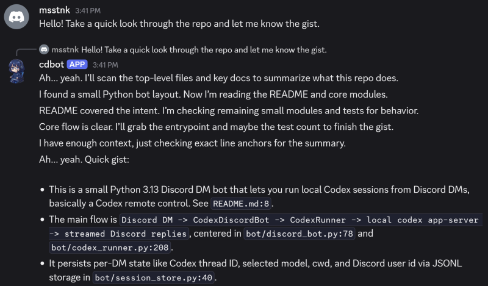
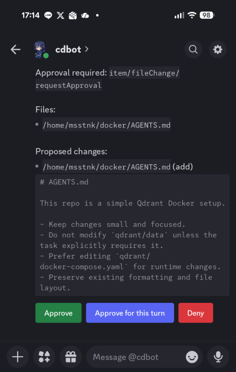

# cdbot


Run Codex from Discord DMs.

`cdbot` turns Discord DMs into a remote control for Codex. You can chat with Codex, stream replies back into Discord, keep sessions alive between messages, and handle approvals without touching your terminal.

The architecture is intentionally simple: one bot process, one local Codex binary, one workspace, and a built-in approval flow for anything that needs confirmation.



## Why?

If you already use Codex locally, Discord ends up being a pretty handy interface:

- Check on a repo from your phone or another machine.
- Keep one DM thread tied to one resumable Codex session.
- Handle approval prompts right inside Discord.
- Switch models or working directories without SSH-ing into anything.

## What it does

- *DM-first workflow*: every DM message is treated as a Codex prompt.
- *Streaming replies*: Codex output is forwarded back to Discord as it arrives.
- *Persistent sessions*: each DM thread maps to its own Codex session, so context sticks around. Use `/clear` if you want a fresh start.
- *In-chat approvals*: command and file-change approvals show up as Discord UI buttons. You can also approve for the rest of the current turn.
- *Remote session controls*: use `/model`, `/cwd`, and related commands to manage the session from Discord.
- *Voice input*: send voice DMs when typing is annoying. The bot transcribes them and forwards the transcript to Codex.



## Quick start

### Requirements

- Python `3.13+`
- `uv`
- A working local Codex installation
- A Discord bot token

### Setup

```bash
git clone https://github.com/msstnk/cdbot.git
cd cdbot

git clone https://github.com/openai/codex.git vendor/codex
uv sync
```

### Set up a Discord server and bot token

1. Create a private Discord server where you're the only member.
   By default, the bot does not do per-user permission checks and will reply to any DM from anyone who shares a server with it.
2. Open the Discord Developer Portal and create a new application.
3. In the **Bot** tab, name your bot and reset the token to get `CDBOT_DISCORD_BOT_TOKEN`.
4. In the **OAuth2** tab, enable the `bot` scope.
   Leave all bot permissions unchecked, copy the generated URL, and open it in your browser.

Note: the bot only responds to DMs, so it does not need any special guild permissions.

### Configure the bot

> [!IMPORTANT]
> By default, the bot replies to any user who shares a server with it.
> You can lock this down with `CDBOT_WHITELISTED_USERS`.
> Discord user IDs are stored in `session_store.jsonl` for accepted sessions and in INFO-or-higher debug logs for rejected sessions.

The app reads environment variables from a `.env` file in the project root:

```bash
cp .env.example .env
```

| Variable | Required | Default | Description |
| --- | --- | --- | --- |
| `CDBOT_DISCORD_BOT_TOKEN` | Yes | - | Discord bot token. |
| `CDBOT_CODEX_HOME` | No | `.codex` | Codex home directory passed to the runtime. |
| `CDBOT_CODEX_BIN` | No | `.codex/bin/codex` | Path to the local Codex binary. Must exist. |
| `CDBOT_CODEX_MODEL` | No | `gpt-5.5` | Default model for new turns. |
| `CDBOT_ENABLE_VOICE_CONTROL` | No | `false` | Enables voice-message transcription in Discord DMs. |
| `OPENAI_API_KEY` | No | empty | Required if you want voice-message transcription. |
| `CDBOT_OPENAI_TRANSCRIPTION_MODEL` | No | `whisper-1` | OpenAI transcription model used for voice messages. |
| `CDBOT_APPROVAL_TIMEOUT_SEC` | No | `60` | How long approval requests wait before defaulting to deny. |
| `CDBOT_SESSION_STORE_PATH` | No | `.local/session_store.jsonl` | JSONL file used to persist DM session state, including the Discord user ID tied to the DM. |
| `CDBOT_WORKSPACE_CWD` | No | current process directory | Root workspace directory for Codex turns. |
| `CDBOT_WHITELISTED_USERS` | No | empty | Comma-separated Discord user IDs allowed to use the bot. Empty means any user who can DM the bot is allowed. |
| `CDBOT_LOCALE` | No | `en_US` | Bot message locale. Bundled locales: `en_US`, `ja_JP`. |
| `CDBOT_DEBUG_LEVEL` | No | `OFF` | Debug log level: `OFF`, `ERROR`, `WARNING`, `INFO`, `DEBUG`, `TRACE`. |
| `CDBOT_DEBUG_LOG_PATH` | No | `.local/cdbot.log` | Path to the debug log file. |

### Enable voice input

Set `CDBOT_ENABLE_VOICE_CONTROL=true` and provide `OPENAI_API_KEY`.
When voice input is enabled, the bot transcribes incoming Discord voice messages and forwards the transcript to Codex.

### Run the bot

Start it with:

```bash
uv run main.py
```

If you want to keep it running as a service, something like this works with `systemd`:

```ini
[Unit]
Description=cdbot service
After=network.target

[Service]
Type=simple
User=user
WorkingDirectory=/home/user/cdbot
ExecStart=/home/user/cdbot/.venv/bin/python3 /home/user/cdbot/main.py
Restart=never

[Install]
WantedBy=multi-user.target
```

## DM commands

These are plain DM messages, not registered Discord slash commands.

| Command | Description |
| --- | --- |
| `/clear` | Clears the saved Codex thread for the current DM while keeping per-DM settings like `cwd` and `model`. |
| `/cwd` | Shows the current working directory for this DM. |
| `/cwd <path>` | Changes the working directory for future turns. The path must stay inside the configured workspace root. |
| `/model` | Shows the currently selected model. |
| `/model <name>` | Changes the model and clears the current session. |

## Notes

- The bot only responds to direct messages, not server channels.
- Working directory changes are intentionally limited to the configured workspace root.
- Voice messages are not treated as control commands like `/clear`, `/cwd`, or `/model`.
- On Ubuntu 24.04, you may need `sudo sysctl -w kernel.apparmor_restrict_unprivileged_userns=0` so Codex can run bubblewrapped commands without errors. See [Codex issue #17337](https://github.com/openai/codex/issues/17337#issuecomment-4322840642) and [Codex issue #14919](https://github.com/openai/codex/issues/14919).

## License

Licensed under the Apache License, Version 2.0.
